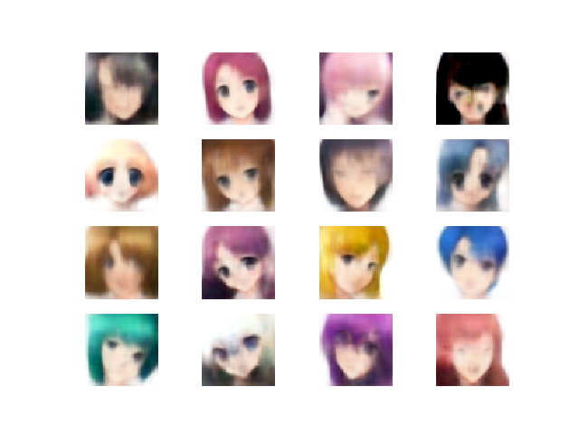
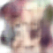

This is repository with my attempt to create a VAE (variational autoencoder) model for anime faces.
Final images look like this (original images is 60x60 px):

Of course, gif:

### For traininig your own model you need:
* numpy
* pytorch (I used 1.5.1)
* opencv (with python support)
* matplotlib

For generating gifs you also need:
* n_sphere
* imageio

For training you should put your images to the 'data' folder and launch train.py.
While training, train.py creates folders with number-name subfolders. You shold use number of folder in generate_table.py.

Dataset I used contains 60000 anime faces cropped from images I fetched from danbooru.
For your own data put your images to the "data" folder in the root directory.
For different (not 60 px) image side change IMAGE_SIDE in train.py and neural networks configuration in nets.py.

[Trained model](https://drive.google.com/file/d/1yUsdGvbNNffSxMMbCIjgDW18cD1nO3ga/view?usp=sharing)
